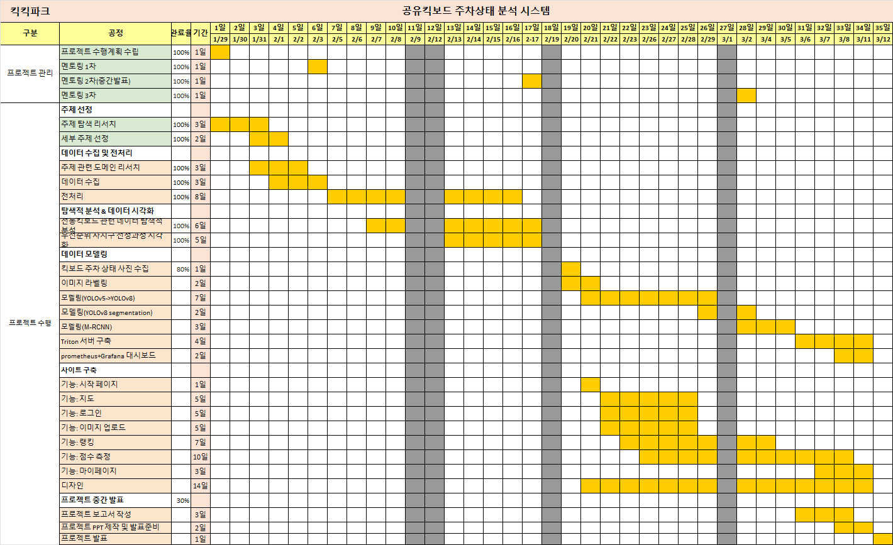
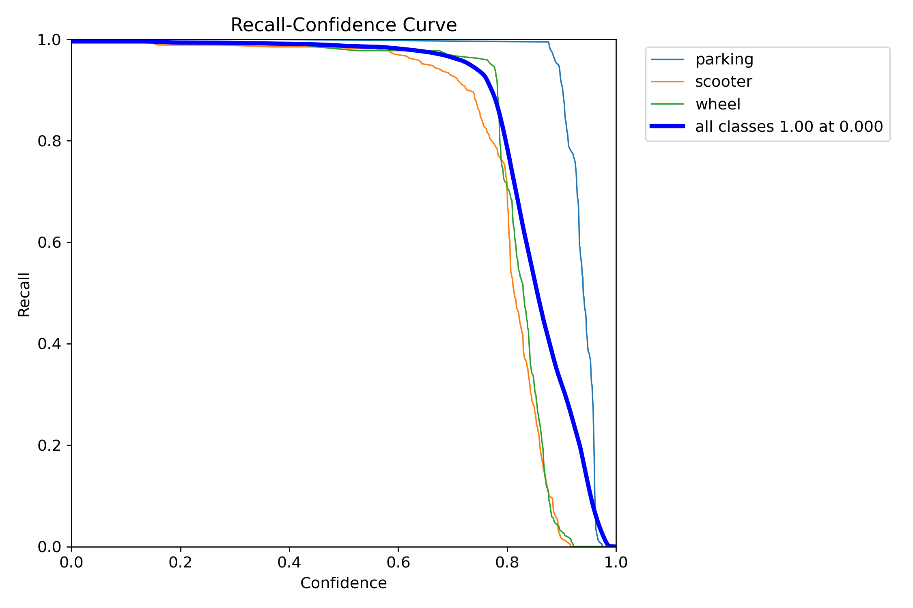
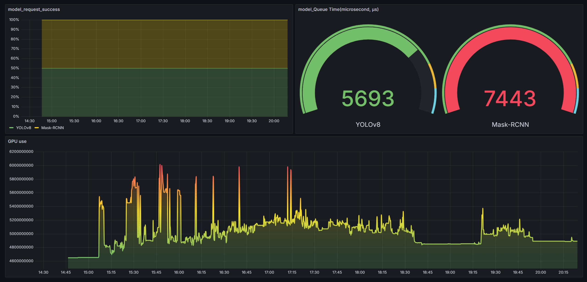

# 공유킥보드 주차상태 분석 시스템
기간 : 24.01.29~24.03.12

# 1. 팀 소개
조장 : 전원영
팀원 : 김민정, 박한솔, 백성은, 정연지

# 2. wbs

# 3. 프로젝트 목적
- 공유킥보드(PM, Personal Mobility)의 관리 개선 및 서비스 구현
# 4. 프로젝트 서론
- PM 주차 입지 선정이 주차 상태에 큰 영향을 끼치지 않을 것이라고 판단
-  PM 서비스 및 기술 발달은 상승하나 인식은 보행자를 위협하는 속도 및 보행을 불편하게 주차 상태를 뽑음
-  PM 사용자의 자발적 참여를 통해서 PM에 대한 긍정적 인식 개선 향상
-   개발한 서비스로 PM 사용자의 흥미를 유발하거나 올바른 주차 상태를 유도

# 5. 프로젝트 서비스

### (1) 아키텍처

### (2) 기능
#### - Front-End
-  회원가입
-  로그인 및 로그아웃
-  반납한 PM 사진찍기
-  점수 랭킹제
-  마이페이지

#### - Back-End
- 유저 관련 정보(계정, 등록 사진, 점수 등) DB 저장
- PM 반납 상태에 따른 점수 부여
-  현재 위치 반영한 지도
- Grafana 모니터링

### (3) 서비스 Mockup

# 6. 프로젝트 이미지 모델링

### (1) 자체 제작 데이터셋 사용
- 라벨링 : parking, scooter, wheel

### (2) 사용한 모델
- YOLOv8
	

	
	

  YOLOv8 모드 중 Segmentation가 존재하나 위의 사진처럼 mask가 중첩되지 않음
  바운딩 박스의 좌표 값 추출
  
- Mask R-CNN
  객체별 mask 추출
  
- 두 가지 모델 사용 이유
	

	
	
	

  Mask R-CNN(오른쪽)에서의 결과 오류를 YOLOv8(왼쪽) 좌표 값으로 구별함
  
### (3)
YOLOv8모델 성능
- 높은 결과 성능을 위한 하이퍼파라미터 조정
#### - 모델 Result

- train/box_loss 및 val/box_loss
  훈련 데이터에서는 시간이 지남에 따라 손실이 감소하고 있으며, 이는 모델이 객체의 위치를 점점 더 잘 예측하고 있음을 의미함 
  검증 데이터에서도 비슷한 추세를 보이지만, 손실 값이 다소 높음. 이는 훈련 데이터에 비해 검증 데이터에서의 성능이 조금 낮을 수 있음을 알 수 있음

- train/cls_loss 및 val/cls_loss
  train, val 모두 손실이 감소하고 있어, 모델이 클래스를 더 정확하게 예측하고 있음을 나타냄

- train/dfl_loss 및 val/dfl_loss
  'dfl_loss'는 'Distribution-Focal Loss'의 약자이며 각 클래스에 대한 예측의 확률 분포를 고려하고 예측 분포와 실제 분포 사이의 불일치를 최소화하여 모델의 성능을 향상시킴
  이 경우에도, 훈련과 검증 모두에서 손실이 감소하고 있음

- metrics/precision(B) 및 metrics/recall(B)
  두 지표 모두 높은 값을 보여주고 있어, 모델이 해당 클래스에서 우수한 성능을 보여줌

- metrics/mAP50(B)
  높은 mAP 값으로 모델이 객체를 잘 탐지하고 있음을 보여줌
   
- metrics/mAP50-95(B)
  높은 값을 보여주고 있어 모델이 다양한 조건에서 잘 작동하고 있음을 나타냄
  
전반적으로, 모델은 학습이 진행됨에 따라 손실이 감소하고 성능 지표가 향상되는 추세를 보이며, 이는 모델이 학습 데이터를 잘 학습하고 있으며 검증 데이터에서도 일반화를 잘 하고 있음을 의미함 그러나, 훈련 데이터에 비해 검증 손실이 다소 높은 것은 과적합의 가능성일 수 있음

- 모든 클래스의 mAP가 0.5 IOU에서 0.994로 매우 높다. 이는 높은 정밀도와 함께 높은 재현율을 가진 모델을 나타냄

- 모든 클래스에 대해 재현율이 1.00으로 나타나고 있으며, 이는 신뢰도가 매우 낮은 점에서도 모델이 모든 실제 참 항목들을 성공적으로 예측하고 있음을 의미함

전반적으로 이 모델은 높은 신뢰도에서 매우 높은 정밀도와 재현율을 보여주고 있으며, 이는 우수한 성능을 가진 객체 탐지 모델을 나타냄
모든 클래스에 대해 일관되게 높은 성능을 유지하는 것으로 보이며, 특히 각 클래스별로도 높은 성능을 보이고 있음을 알 수 있음음

# 7. 프로젝트 이미지 모델링 결과

- 주차장 mask와 킥보드 휠 mask의 겹침의 정도를 구하여 위 표와 같이 점수 부여

# 8. Trition 서버

 

- YOLOv8 + MR-CNN의 순차적 처리와 Triton을 이용한 병렬처리
- 속도는 약 2배 이상 차이
- 성능은 거의 90~100%로 비슷

# 9. 실시간 모니터링(Grafana)

 

- 서버 및 모델의 리소스 사용에 대한 실시간 모니터링  

# 10. 기대효과

# 11. 사용 툴

## 1) 데이터 및 데이터 분석
- Python
- Labelme
- YOLOv8
- PyTorch
- MySQL

## 2) 서비스 서버 구축
- AWS
- Django
- NVIDIA TRITON

## 3) API
- 위치 : Kakaomap MAPS API
- 챗봇 : OpenAI

## 4) 소통
- Discord
- ZOOM
- Notion

## 5) DevOps
- GitHub

# 12. 프로젝트 후기

`데이터 분석을 통한 깊은 통찰과 이해의 여정에서 시간과 자원의 한계를 극복하며, 분석 기술과 문제 해결 능력의 중요성을 깨달음`

